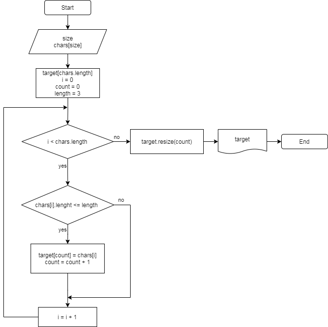

# **Итоговая проверочная работа блока "Выбор специализации"**
> [ссылка]( https://gbcdn.mrgcdn.ru/uploads/asset/4283449/attachment/1251e74b703108ee483caaa98787097d.png) на полное описание задания

## Описание решения
**Задача:**

      Написать программу, 
      которая из имеющегося массива строк формирует массив из строк, 
      длина которых меньше либо равна 3 символа. 
      Первоначальный массив можно ввести с клавиатуры, 
      либо задать на старте выполнения алгоритма. 
      При решении не рекомендуется пользоваться коллекциями, 
      лучше обойтись исключительно массивами.

**Примеры:**

    ["hello", "2", "world", ":-)"] -> ["2", ":-)"]
    ["1234", "1567", "-2", "computer science"] -> ["-2"]
    ["Russia", "Denmark", "Kazan"] -> []

**Решение:**

* Задается первоначальный массив. 
    * Пользователю необходимо ввести размер массива и элементы массива. На этапе ввода размера массива, происходит проверка, что значение должно быть целым положительным числом. Функциональность создания пользователем первоночального массива реализована с помощью функций **GetInputNumber** и **CreateArray**. **GetInputNumber** реализует функциональность ввода размера массива через консоль и проверку значения на натуральность. **CreateArray** реализует функциональность ввода элементов массива через консоль.
* Формирование массива из строк первоначального массива, длина которых меньше либо равна 3 символа.
    * Функциональность реализована с помощью функции **FilterByLength**. Функция на вход принимает первоначальный массив и значение предельной длины строк возвращаемого массива. В функции происходит перебор строк переданного в параметрах массива и добавление в предварительно созданный новый возвращаемый массив строк, длина которых меньше или равна второму входному параметру функции.
* Вывод результата.
    * Функциональность реализована с помощью функции **PrintArray**. Функция на вход принимает массив и перебирая его строки выводит их в консоль.

**Блок-схема:**

